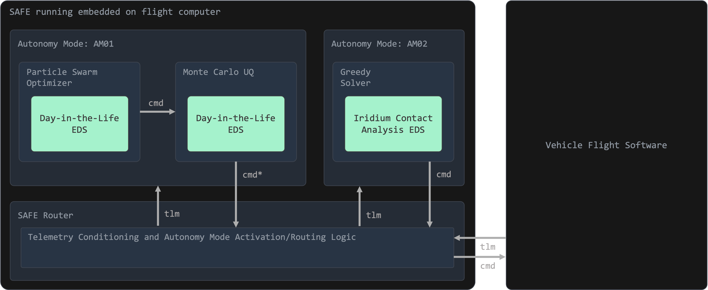

# Sedaro Autonomy Framework for Edge (`safe`)

Sedaro Autonomy Framework for Edge (`safe`) is an open-source flight software mission autonomy framework that integrates Sedaro's Edge Deployable Simulators (EDS's) alongside third-party software to achieve trusted satellite autonomy across the mission lifecycle.  `safe` exists to enable third-party autonomy to operate our most critical commercial and national security assets with full flight assurance.


`safe` establishes a host-agnostic runtime abstraction for orchestrating untrusted autonomy wrapped in deterministic modsim harnessing to deliver trust and mission assurance.

The design behind `safe` leverages concepts from world-class orchestration engines like kubernetes.  Each "Autonomy Mode" is executed in an isolated sandbox where stdout/stderr is captured and persisted, process lifecycle is maintained (w/ retry and keep-alive), durable inter-process communication is established, and host command and telemetry interoperability is guaranteed and validated.  `safe` defines activation syntax to dictate when modes "take the wheel" and a centralized command authority de-conflicts misaligned command intent and unsafe host configurations.

The real power of `safe` is achieved when paired with Sedaro Edge Deployable Simulators (EDS) to deliver ultra high-performance, multi-physics modsim harnessing to the edge for in situ decision making and/or command verification & validation.  **Edge Deployable Simulators are exportable, high-fidelity vehicle and environment simulators generated by Sedaro's commercial modsim platform for execution onboard flight computers at many orders of magnitude faster than real-time.**  EDS provides a host system with predictive situational awareness of itself, it's environment, and its teammates.  EDS export is available from any Sedaro Platform instance with any license tier for any scenario model.

## Yet Another Autonomy Framework?

You're probably already familiar with the Robot Operating System (ROS) which is an existing autonomy framework. Like most autonomy/robotics frameworks, ROS/ROS2 is primarily just a IPC/message-passing implementation with many developer experience features.  Terrestrially, robotics and autonomy teams either use ROS/ROS2 or they roll their own solution.

`safe` is a purpose built capability that is necessarily distinct from ROS (and ROS competitors).  `safe`'s value proposition within this already mature ecosystem stems from three main principles:

1. 🤖 `safe` isn't a real-time robotics framework.  It's an autonomous mission operations framework.  You aren't making your spacecraft a robot by adopting `safe` - hopefully it is already a robot per your fight software (FSW).  Instead, you're making your mission operations a robot.  You're taking what you already do on the ground in the form of scheduling, anomaly resolution, and maintenance and you're deploying it at the edge.  Fully online mission operations, no overpass required.
2. 🧑‍💻 `safe` makes using Sedaro simulators and studies capabilities really easy and fast.  You can typically throw together functional decision making capabilities in under 1 hour with the power of the Sedaro Platform.  Terrestrial mission ops today relies heavily on modeling and simulation by humans.  `safe` takes the ground out of the loop.
3. 📡 `safe` implements host-native C2.  This means that zero new interfaces are required to integrate `safe` onto a host vehicle.  While `safe` is designed to run on board, because `safe` speaks native C2, nothing is stopping you from running `safe` off board in your ops center instead.

## Use Cases

There are two discrete `safe` topologies: Service and Flight Director ("Flight" for short)

### Services
A `Service` can be asked the question "Is this command sequence safe to execute?" and receive back a "yes/no".

### Flight (i.e. Flight Director)

`Flight` is fed host telemetry and produces vetted command sequences to be executed on the host. If desired, commands from a Flight instance can be validated by a Service.

## Architecture

When paired with Sedaro EDS's, `safe` delivers trusted satellite mission autonomy over long durations without ground contact. `safe` realizes a flexible framework that can be readily applied to a diverse array of missions and edge compute devices.  

Features:
1. Autonomy modes offering various levels of intelligence and risk posture interface to core flight software using a built in native C2 interface to consume current system state from telemetry and issue commands to their host vehicle. 
2. A Router sets the active autonomy mode based on telemetry so that developers and mission planners can design an array of modes that incorporate various autonomy approaches for each mission phase, potential state of the vehicle, and potential state of its operating environment. 
3. Batteries-included developer libraries for multi-simulation, multi-parameter optimization and risk analysis, in addition to turnkey support for the integration of EDS’s, enables streamlined development of `safe` autonomy modes.



## Getting Started

```bash
cargo build --workspace
cargo run -p safe
```

The default configuration leverages two Autonomy Modes:
1. `AM01`: Anomaly Recovery Agent: A agentic harness around an LLM to detect and respond to anomalies in the host vehicles telemetry
  - Note: This mode requires access to a language model.  See instructions below for running Mistral.
2. `AM02`: Overpass Predictor: A simple Autonomy Mode that forecasts overpasses over pre-configured ground sites based on forward TLE propagation.

See `safe/autonomy_mode_config.json` for each mode's specific configuration.

To run Mistral for `AM01`:
```bash
docker run -d -v ollama:/root/.ollama -p 11434:11434 --name ollama ollama/ollama
docker exec -it ollama ollama run mistral:7b
```

SAFE can be observed via:

```bash
cargo run -p safectl -- status
cargo run -p safectl -- logs
cargo run -p safectl -- watch telemetry
```

Send a telemetry frame through the local ingress socket:

```bash
cargo run -p safectl -- send telemetry --json '{"telemetry":{"batt_v":34.5}}'
```

Stop SAFE with `Ctrl-C`. Configuration path resolution, adapters, and runtime
directories are documented in [`runtime-config.md`](./safe/docs/runtime-config.md).

## Development

The repository pins Rust `1.94.1` in `rust-toolchain.toml`.

```bash
cargo build --workspace
cargo test --workspace
```

To develop an autonomy mode, implement the public `ModeHandler` contract and
launch it through `run_mode`. Start with
[`mode-development.md`](./safe/docs/mode-development.md) and
[`mode-protocol.md`](./safe/docs/mode-protocol.md). The LLM advisor has its
own configuration and fixture documentation in
[`mode-anomaly-recovery/README.md`](./mode-anomaly-recovery/README.md).

## Documentation

- [`Runtime configuration`](./safe/docs/runtime-config.md)
- [`Activation configuration`](./safe/docs/activation-config.md)
- [`safectl reference`](./safe/docs/safectl.md)
- [`Mode development`](./safe/docs/mode-development.md)
- [`Mode protocol`](./safe/docs/mode-protocol.md)
- [`Runtime operations`](./safe/docs/runtime-operations.md)
- [`Contributor guide`](./CONTRIBUTING.md)
- [`Roadmap and limitations`](./Roadmap.md)
- [`safe-time API`](./safe-time/README.md)
- [`safe-sim studies and simulation API`](./safe-sim/README.md)
- [`Generic EDS gatekeeper`](./safe-gatekeeper/README.md)


## Workspace Layout

- [`safe/`](./safe/): SAFE library, daemon, runtime, router, transports, and
  platform adapters.
- [`safectl/`](./safectl/): CLI for interacting with a running SAFE daemon.
- [`safe-time/`](./safe-time/): GPS, UTC, MJD, and attitude utility functions.
- [`safe-sim/`](./safe-sim/): Sedaro EDS simulation execution, output decoding,
  trade studies, and Monte Carlo studies.
- [`safe-gatekeeper/`](./safe-gatekeeper/): Generic EDS-backed command-batch
  safety evaluation using mission-provided simulation inputs.


## License

This project is licensed under the [Apache-2.0 License](./LICENSE).
